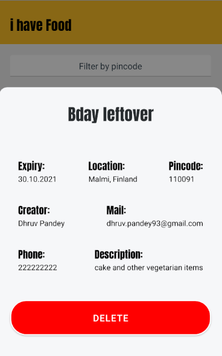

<h2>Splash Screen</h2>

<h2>Home Screen: showing list of food entries</h2>

<h2>Filtering by Pincode Option</h2>

<h2>Forms and Validations using Formik: To add new food entry</h2>

<h2>Details of an entry using Bottom Sheet Modal</h2>

<h2>Google Firebase Push Notifications</h2>

Custom Fonts Installation
=================================
https://www.youtube.com/watch?v=g64x5mJadbk
(Dont use fontWeight:"bold", it is breaking the font family, Ref: https://stackoverflow.com/a/58765980 )

Git steps
===================
git init -b main
git remote add origin https://github.com/pdhruv93/i-have-food-react-native.git
git add . && git commit -m "initial commit" && git push
git push origin main

Formik Introduction
=================================
https://www.youtube.com/watch?v=t4Q1s8WntlA

Firebase DB Usage
=================================
https://rnfirebase.io/database/usage
